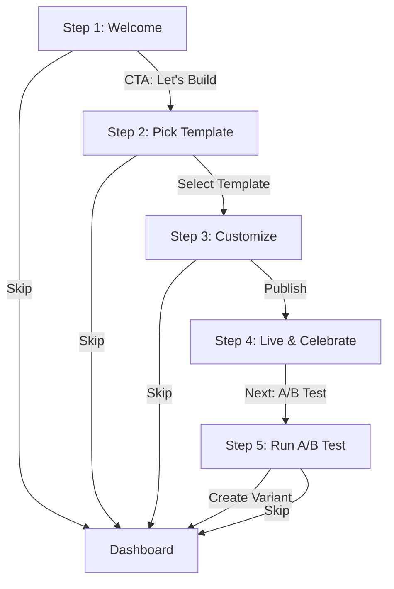

# Inner Circle Winners: Guided Onboarding Flow

**AHA MOMENT**: "I built my first high-converting page from a template and ran my first A/B test."
**Target Duration**: 5 Minutes

---

## Onboarding Flow Diagram

---

## Step-by-Step Breakdown

### STEP 1: "Welcome to Inner Circle"
*   **Copy**: "Welcome to the Inner Circle, {{first_name}}. You're minutes away from your first high-converting page. We've built the tools—now let's build your machine."
*   **Visual**: A 15-second looping animation showing the Page Builder (drag-and-drop), A/B Test (Variant A/B split), and Analytics (upward trend line).
*   **Duration**: 30 Seconds
*   **Skip Option**: "Skip to Dashboard" (Bottom right, subtle)
*   **Next Step Logic**: Linear to Step 2.

### STEP 2: "Pick a Template"
*   **Copy**: "Choose your starting point. These templates are curated for **{{industry}}** based on 2.5M+ conversion data points."
*   **Visual**: A clean 2x3 grid of high-fidelity templates. Hovering over a template shows a "Conversion Potential: 92%" badge.
*   **Duration**: 2 Minutes
*   **Skip Option**: "I'll start from scratch" (Redirects to empty builder)
*   **Next Step Logic**: Linear to Step 3.

### STEP 3: "Customize in Seconds"
*   **Copy**: "Make it yours. Change the headline, swap the image, and match your brand colors. Every element is optimized for speed and conversion."
*   **Visual**: A simplified "Guided Builder" interface. A pulsing tooltip points to the Headline: "Try changing this to something bold."
*   **Duration**: 2 Minutes
*   **Skip Option**: "Use default settings" (Proceeds with template defaults)
*   **Next Step Logic**: Linear to Step 4.

### STEP 4: "Your Page is Live!"
*   **Copy**: "Boom! Your page is live at: `winners.io/{{slug}}`. You're now ahead of 90% of your competition."
*   **Visual**: A full-screen confetti animation with a preview of their customized page inside a browser frame.
*   **Duration**: 30 Seconds
*   **Skip Option**: None (This is a milestone)
*   **Next Step Logic**: Auto-advance or "Let's Optimize" button to Step 5.

### STEP 5: "Run Your First A/B Test"
*   **Copy**: "Don't guess—test. A/B testing lets you run two versions of your page to see which one makes more money. Let's create a variant."
*   **Visual**: A split-screen view showing "Original" and "Variant". A button labeled "Create Variant B" pulses.
*   **Duration**: 1 Minute
*   **Skip Option**: "Maybe later" (Redirects to Dashboard)
*   **Next Step Logic**: Completion → Redirect to Dashboard with "Test Active" status.

---

## Visual Assets List

1.  **`onboarding-welcome.mp4`**: High-energy motion graphics video (15s).
2.  **`template-thumbnails/`**: 6x High-res PNGs of industry-specific templates (E-comm, SaaS, Agency).
3.  **`builder-ui-overlay.png`**: Transparent PNG of the builder sidebar for the "Guided" look.
4.  **`confetti-lottie.json`**: Lottie animation for the success milestone.
5.  **`ab-test-visualization.svg`**: Animated SVG showing traffic splitting 50/50 between two pages.
6.  **`industry-icons/`**: SVG icons for E-comm (Cart), SaaS (Cloud), and Agency (Users).
